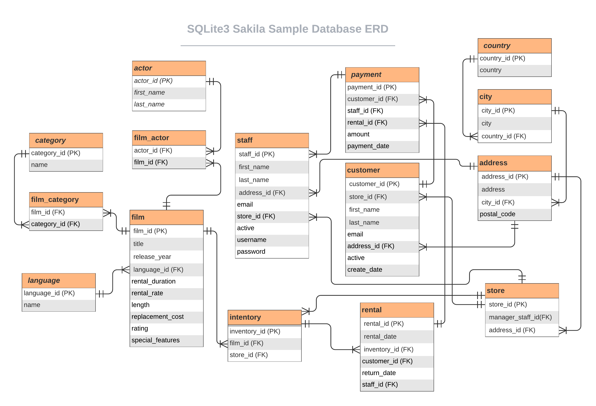

# Learning SQL 3<sup>rd</sup> Edition

Solutions repo to [Learning SQL 3<sup>rd</sup> Edition](https://www.oreilly.com/library/view/learning-sql-3rd/9781492057604/).

## Sakila ER Diagram



## Getting the DB

I used `sqlite3` as the DBMS and got the data from the following [kaggle link](https://www.kaggle.com/datasets/atanaskanev/sqlite-sakila-sample-database?resource=download&select=sqlite-sakila-db).

## Stats

```
===============================================================================
 Language            Files        Lines         Code     Comments       Blanks 
===============================================================================
 Markdown                2           28            0           15           13 
 Python                  1           30           19            0           11 
 SQL                    37          277          262           10            5 
===============================================================================
 Total                  40          335          281           25           29 
===============================================================================
```
